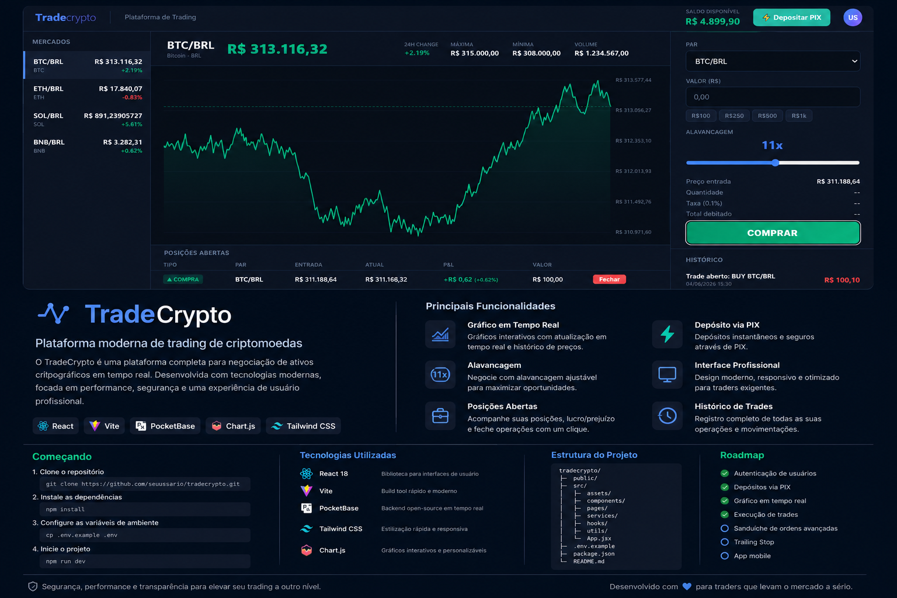

# 🚀 TradeCrypto

<p align="center">
  
</p>

<p align="center">
  <strong>Plataforma moderna de trading de criptomoedas com operações em tempo real, depósitos via PIX e gerenciamento de portfólio.</strong>
</p>

<p align="center">
  
  
  
  
</p>

---

## 📈 Sobre o Projeto

O **TradeCrypto** é uma plataforma web inspirada nas corretoras profissionais de criptomoedas.

O sistema permite:

* 📊 Visualização de gráficos em tempo real
* 💰 Compra e venda de ativos
* 💳 Depósitos via PIX
* 🏦 Solicitação de saques
* 👤 Cadastro e autenticação de usuários
* 📋 Histórico de operações
* 💼 Gerenciamento de portfólio
* 📱 Interface responsiva

---

## ✨ Funcionalidades

### 🔐 Autenticação

* Cadastro de usuários
* Login seguro
* Persistência de sessão
* Proteção de rotas

### 📈 Trading

* Compra de ativos
* Venda de ativos
* Controle de posições abertas
* Histórico de negociações

### 💰 Carteira

* Saldo disponível
* Controle financeiro
* Histórico de movimentações

### PIX

* Depósito via PIX
* Geração de QR Code
* Solicitação de saque
* Histórico de saques

---

## 🛠️ Tecnologias Utilizadas

### Frontend

* React
* React Router DOM
* Tailwind CSS
* Lucide React
* Recharts
* Sonner
* Framer Motion

### Backend

* Node.js
* Express.js
* PocketBase

### Banco de Dados

* SQLite (PocketBase)

---

## 📂 Estrutura do Projeto

```bash
tradecrypto/
│
├── backend/
│   ├── api/
│   ├── routes/
│   ├── pocketbase/
│   ├── server.js
│   └── package.json
│
├── web/
│   └── frontend/
│       ├── public/
│       ├── src/
│       │   ├── components/
│       │   ├── contexts/
│       │   ├── pages/
│       │   ├── lib/
│       │   ├── hooks/
│       │   └── App.jsx
│       │
│       └── package.json
│
└── README.md
```

---

## ⚙️ Instalação

### 1. Clonar o projeto

```bash
git clone https://github.com/seuusuario/tradecrypto.git
```

### 2. Entrar na pasta

```bash
cd tradecrypto
```

### 3. Instalar dependências do frontend

```bash
cd web/frontend
npm install
```

### 4. Instalar dependências do backend

```bash
cd ../../backend
npm install
```

---

## 🚀 Executando o Projeto

### Iniciar PocketBase

```bash
cd backend/pocketbase

./pocketbase.exe serve
```

Painel:

```text
http://127.0.0.1:8090/_/
```

---

### Iniciar Backend

```bash
cd backend

npm start
```

Servidor:

```text
http://localhost:3001
```

---

### Iniciar Frontend

```bash
cd web/frontend

npm run dev
```

Aplicação:

```text
http://localhost:5173
```

---

## 🔧 Variáveis de Ambiente

Backend `.env`

```env
PORT=3001
CORS_ORIGIN=*
PIX_KEY=sua-chave-pix
```

Frontend `.env`

```env
VITE_API_URL=http://localhost:3001
VITE_POCKETBASE_URL=http://127.0.0.1:8090
```

---

## 📸 Screenshots

### Dashboard

Interface moderna inspirada em plataformas profissionais de trading.

### Trading

Execução de compra e venda de ativos.

### Wallet

Controle de saldo e operações financeiras.

---

## 🗺️ Roadmap

* [x] Autenticação
* [x] Dashboard
* [x] Trading
* [x] Depósito PIX
* [x] Saque PIX
* [x] PocketBase
* [ ] Integração AbacatePay
* [ ] Gráficos avançados TradingView
* [ ] Stop Loss
* [ ] Take Profit
* [ ] Aplicativo Mobile
* [ ] WebSocket em tempo real

---

## 👨‍💻 Desenvolvido por

**Gislaine Lopes**

Projeto criado para estudos avançados de:

* React
* Node.js
* PocketBase
* APIs REST
* Fintechs
* Trading Systems

---

⭐ Se gostou do projeto, deixe uma estrela no repositório.
